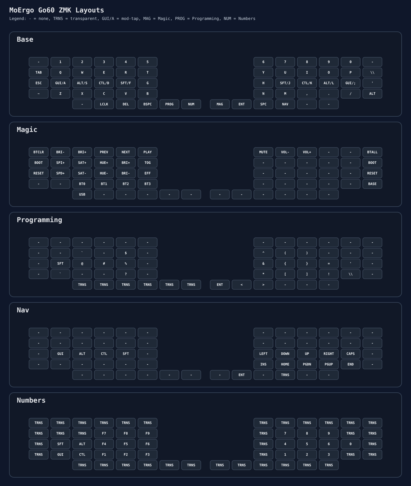

# MoErgo Go60 Custom Configuration for ZMK

This repository contains my custom ZMK configuration for the MoErgo Go60, based on a QMK layout from a BastardKB Dilemma from this [original QMK repo](https://github.com/Alan-TheGentleman/qmk_userspace)
## Current Layout

This keymap is based on home row mods and uses 5 layers:

1. `Base`
2. `Magic`
3. `Programming`
4. `Nav`
5. `Numbers`

### Visual Layout (SVG)

The main reference is the SVG below, which shows all layers and the lower-block mapping in Go60 physical order.

If the preview is too small on GitHub, open the file directly: [`go60-layouts.svg`](go60-layouts.svg).

### Quick Layer Summary

- `Base`: daily typing layer with home-row mod-taps and Go60 lower block (`LCLK`, `DEL`, `NAV`, `PROG`, `NUM`, `MAGIC`).
- `Magic`: Bluetooth profile management, RGB controls, media, reset/bootloader.
- `Programming`: symbols-focused layer (e.g. `` ` $ ^ ( ) @ # % & { } = ? * [ ] ! \ ``), keeps `Enter`, `<`, `>` on right thumb cluster.
- `Nav`: left hand modifiers, right hand arrows/navigation (`INS`, `HOME`, `PGDN`, `PGUP`, `END`).
- `Numbers`: left side `F1-F9` (+ modifiers), right side `1-9` and `0`.

## Reference Files

- `config/go60.keymap` - actual ZMK keymap in use
- `go60-layouts.svg` - SVG layout reference
- `config/go60.keymap.backup-pre-port-2026-04-25` - backup of the factory go60 config

`config/go60.keymap` is the source of truth. Keep the SVG reference in sync when changing the keymap.

## Notes

- The lower block must follow the Go60 physical order used in `main`:
  - line 5 of each layer = extra row
  - line 6 of each layer = thumbs
- This repository builds a single `go60.uf2`, but the same UF2 must be flashed to both halves.

Legend:

- `TRNS` = transparent
- `GUI/A` = `GUI` on hold, `A` on tap
- `LCLK` = left click
- `PROG` = Programming layer
- `NUM` = Numbers layer
- `MAGIC` = Magic layer

## Resources

- The [original QMK repo](https://github.com/Alan-TheGentleman/qmk_userspace) used as reference for this config.

- The [official MoErgo Go60 Support](https://moergo.com/go60-support) website. Go60 documentation and other technical resources.
- The [official MoErgo Discord Server](https://moergo.com/discord). Instant conversations with other Go60 users.

- The [official ZMK Documentation](https://zmk.dev/docs) website. Find answers to many common questions about ZMK firmware.
- The [official ZMK Discord Server](https://discord.gg/8cfMkQksSB). Instant conversations with other ZMK developers and users. Great technical resource!

- The [official MoErgo ZMK Distribution](https://github.com/moergo-sc/zmk). Repository for ZMK firmware customized for Go60 and Glove80.

## Firmware Files
To locate your firmware files and reflash the keyboard:

1. Open the repository on GitHub.
2. Go to `Actions`.
3. Open the desired `Build` workflow run.
4. Download the `go60.uf2` artifact.
5. Flash that same `go60.uf2` to the left half.
6. Flash that same `go60.uf2` to the right half.

After both halves are flashed, power on the left half first and then the right half.
